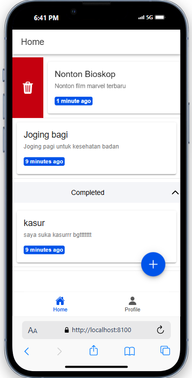

## Read

Read (loadTodos)

- Fungsi loadTodos mengambil semua data todo dari database.
- Menggunakan firestoreService.getTodos untuk mengambil daftar todo, kemudian menyimpannya ke variabel todos.
- Fungsi ini digunakan saat halaman dimuat pertama kali dengan memanggilnya dalam onMounted. Selain itu, loadTodos juga dipanggil setelah operasi create, update, atau delete untuk memuat kembali daftar todo yang terbaru.

  
## Create

Create (handleSubmit)

- Fungsi handleSubmit menangani penambahan dan pengeditan (create dan update) todo.
- Jika editingId bernilai null, maka ini adalah operasi penambahan (create). Kode akan menambahkan todo baru ke dalam database dengan memanggil firestoreService.addTodo.
- Jika editingId tidak bernilai null, ini berarti sedang mengedit todo yang sudah ada. Kode akan memperbarui todo yang ada di database dengan firestoreService.updateTodo, menggunakan ID todo yang ada di editingId.
- Setelah berhasil menambahkan atau memperbarui, showToast akan ditampilkan untuk memberikan notifikasi kepada pengguna.

## Update

Update (`handleStatus`)
- Fungsi handleStatus mengubah status todo antara active dan completed.
- Jika todo berada di bagian aktif, statusnya akan diubah menjadi completed, dan sebaliknya.
- Kode memanggil firestoreService.updateStatus untuk memperbarui status di database, lalu menampilkan notifikasi dengan showToast yang menunjukkan perubahan status.
- Setelah status diperbarui, loadTodos akan dipanggil untuk memuat kembali daftar todo.

  

## Delete

Delete (handleDelete)

- Fungsi handleDelete menghapus todo dari database berdasarkan ID.
- Fungsi ini dipanggil baik saat pengguna menggeser (swipe) todo atau mengklik tombol hapus.
- Kode memanggil firestoreService.deleteTodo untuk menghapus todo dari database dan kemudian menampilkan notifikasi konfirmasi penghapusan.
- Setelah berhasil menghapus, loadTodos dipanggil kembali untuk memperbarui tampilan daftar todo di layar.

## **Langkah-langkah Membangun Aplikasi Ionic dengan Vue.js Menjadi File APK**

#### **1. Menyiapkan Proyek Ionic dengan Vue.js**

Sebelum membangun aplikasi menjadi APK, pastikan proyek Ionic kamu sudah siap dan berfungsi dengan baik. Berikut adalah persiapannya:

1.  **Install Ionic CLI (Jika belum terinstall):** Untuk menginstall Ionic CLI, jalankan perintah berikut:
    
    `npm install -g @ionic/cli` 
    
2.  **Buat Proyek Baru (Jika belum ada):** Jika kamu belum memiliki proyek, buat proyek baru dengan perintah:
    
    `ionic start myApp blank --type vue` 
    
    Gantilah `myApp` dengan nama proyek yang kamu inginkan.
    
3.  **Install Capacitor (Jika belum ada):** Capacitor adalah alat yang digunakan untuk membangun aplikasi mobile. Install Capacitor dengan perintah:
    
    `npm install @capacitor/core @capacitor/cli` 
    

#### **2. Menambahkan Platform Android ke Proyek**

Setelah proyek Ionic berhasil dibuat, tambahkan platform Android dengan perintah berikut:

`npx cap add android` 

Perintah ini akan membuat folder `android/` di dalam proyek kamu, yang berisi proyek Android native yang dibangun menggunakan Capacitor.

#### **3. Membuat Build Produksi untuk Web**

Proses selanjutnya adalah membuat build produksi aplikasi web kamu. Build ini akan digunakan sebagai bagian dari aplikasi Android.

1.  **Membangun Proyek untuk Produksi:** Jalankan perintah berikut untuk membuat build aplikasi dalam mode produksi:
    
    `ionic build --prod` 
    
    Hasil build akan ditempatkan di dalam folder `www/` atau `dist/`, tergantung pada konfigurasi proyek kamu.

#### **4. Menyinkronkan Web Assets ke Platform Android**

Setelah build selesai, kamu perlu menyinkronkan web assets ke proyek Android menggunakan Capacitor:

`npx cap sync android` 

Perintah ini akan menyalin file dari folder `www/` atau `dist/` ke proyek Android yang ada di folder `android/`.

#### **5. Membangun APK di Android Studio**

Sekarang saatnya membangun file APK menggunakan Android Studio.

1.  **Buka Proyek Android di Android Studio:** Jalankan perintah berikut untuk membuka proyek Android di Android Studio:
    
    `npx cap open android` 
    
    Perintah ini akan membuka proyek Android di Android Studio.
    
2.  **Membangun APK:** Di Android Studio, pilih menu `Build > Build APK(s)`, lalu pilih `Build`. Setelah proses build selesai, file APK akan dihasilkan.
    

#### **6. Menemukan dan Menjalankan APK**

File APK yang sudah dibangun bisa ditemukan di dalam folder berikut:

`android/app/build/outputs/apk/debug/` 

Di dalam folder tersebut, kamu akan menemukan file `app-debug.apk` yang bisa dipasang di perangkat Android.

#### **7. Menginstal APK di Perangkat Android**

Untuk menginstal APK pada perangkat Android, kamu bisa menghubungkan perangkat Android ke komputer menggunakan kabel USB dan mengaktifkan `Developer options` serta `USB debugging` di perangkat Android.

Jika perangkat sudah terhubung, kamu bisa menggunakan perintah berikut untuk menginstal APK:

`adb install android/app/build/outputs/apk/debug/app-debug.apk` 

Alternatif lainnya, kamu juga bisa mentransfer file APK ke perangkat Android dan menginstalnya secara manual.

## Hasil file app-debug.apk
