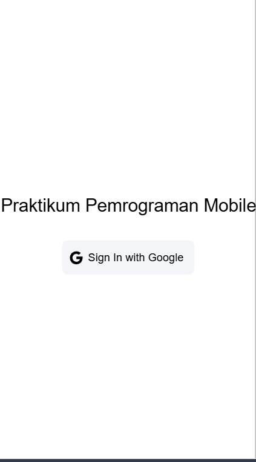

## Halaman Login

1. Pengguna Menekan Tombol Login:
Pengguna melihat halaman login dengan tombol “Sign In with Google” dan menekan tombol tersebut.

2. Proses Autentikasi Dimulai: 
Ketika tombol ditekan, fungsi login dipanggil dan memulai proses autentikasi menggunakan metode loginWithGoogle dari authStore.

3. Redirect ke Google untuk Login:
Metode loginWithGoogle mengarahkan pengguna ke Google untuk login. Di sini, pengguna akan diminta untuk memilih akun Google dan memberikan izin akses:

4. Google Mengembalikan Data Pengguna:
Setelah berhasil login, Google mengembalikan data pengguna (seperti nama, email, dan foto profil) ke aplikasi.

5. Pengguna Masuk ke Aplikasi:
Aplikasi menerima data pengguna dan mencatat status login. Pengguna kemudian diarahkan ke halaman utama atau dashboard sesuai alur aplikasi.

## Halaman Home

1. Struktur Dasar Halaman
Halaman menggunakan komponen ion-page, yang merupakan komponen utama untuk sebuah halaman dalam aplikasi Ionic.
Header: Bagian header (ion-header) menampilkan judul halaman dengan teks "Home".
Content: Bagian isi halaman (ion-content) digunakan untuk menampung konten utama.
2. Komponen TabsMenu
Pada bagian bawah ion-content, komponen TabsMenu dimuat. Ini adalah komponen terpisah yang ditambahkan sebagai child di dalam halaman.
TabsMenu mungkin berfungsi sebagai menu navigasi tab di aplikasi ini, memungkinkan pengguna beralih antar tab utama (meskipun detail implementasinya tidak terlihat di sini).

## Halaman Profil

1. Mengambil Data Pengguna dan Menampilkan Avatar
Ketika halaman profil dimuat, aplikasi mengambil data pengguna dari authStore (sebuah Vuex store khusus untuk autentikasi).
Variabel user didefinisikan menggunakan computed, sehingga selalu memiliki data pengguna terbaru dari authStore.
Variabel userPhoto diinisialisasi dengan URL avatar default, yang akan digantikan dengan foto pengguna jika ada.
2. Menentukan Foto Profil Pengguna
Fungsi updateUserPhoto memeriksa apakah pengguna memiliki URL photoURL (dari autentikasi Google, misalnya).
Jika ada, variabel userPhoto di-update untuk menggunakan URL tersebut; jika tidak, tetap menggunakan avatar default.
3. Pemantauan Perubahan Data Pengguna
Menggunakan watch untuk memantau perubahan pada user.
Setiap kali data user diperbarui, updateUserPhoto dipanggil untuk memastikan userPhoto menampilkan foto terbaru.
4. Fallback Saat Foto Profil Gagal Dimuat
Jika terjadi error saat memuat userPhoto, fungsi handleImageError mengganti userPhoto dengan URL avatar default, sehingga gambar cadangan tetap tampil.
5. Logout
Tombol logout ada di bagian header. Ketika diklik, tombol ini menjalankan fungsi logout, yang memanggil metode logout di authStore untuk mengeluarkan pengguna dari akun mereka.